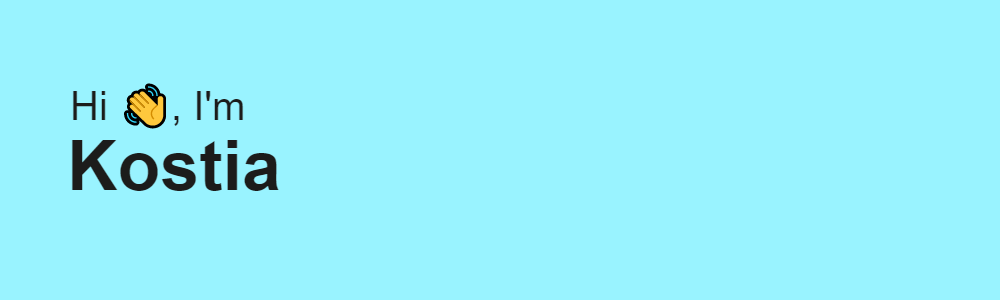

----

<h3 align="center">Computer Science student from Ukraine </h3>

----

### About me:

My name is Kostia, and I'm C++ and Python Developer from Kyiv.

- Studying in Igor Sikorsky Kyiv Polytechnic Institute.
- In my free time, I create pet-projects and read tech articles.

----

### Languages and Tools :

----

### Connect with me :

----

### My Stats:

